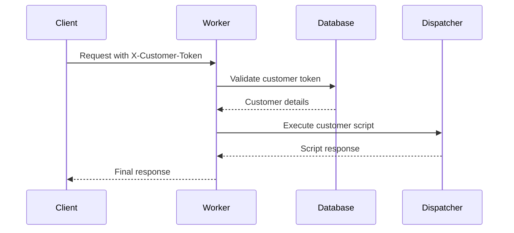

# 🧠 ElizaOS-OpenCog-GnuCash Technical Documentation

## System Architecture Overview

The ElizaOS-OpenCog-GnuCash Workers for Platforms system represents a revolutionary integration of cognitive AI, financial intelligence, and edge computing. This documentation provides comprehensive technical details for developers and system administrators.

## 🏗️ Architecture Components

### 1. Cloudflare Workers for Platforms Layer
```
┌─────────────────────────────────────────────────────────────┐
│                    Edge Network Layer                       │
│  Global CDN • DDoS Protection • SSL/TLS • Auto-scaling     │
└─────────────────────────────────────────────────────────────┘
                                │
┌─────────────────────────────────────────────────────────────┐
│                 Workers for Platforms Core                  │
│  ┌─────────────────┐  ┌─────────────────┐  ┌──────────────┐ │
│  │   Dispatch      │  │   Resource      │  │   Security   │ │
│  │   Namespace     │  │   Management    │  │   Isolation  │ │
│  └─────────────────┘  └─────────────────┘  └──────────────┘ │
└─────────────────────────────────────────────────────────────┘
```

### 2. Cognitive Intelligence Stack
```
┌─────────────────────────────────────────────────────────────┐
│                  ElizaOS-OpenCog Engine                     │
│  ┌─────────────────┐  ┌─────────────────┐  ┌──────────────┐ │
│  │   ElizaOS       │  │    OpenCog      │  │   GnuCash    │ │
│  │   Multi-Agent   │  │   Cognitive     │  │   Financial  │ │
│  │   Framework     │  │   Architecture  │  │   Engine     │ │
│  └─────────────────┘  └─────────────────┘  └──────────────┘ │
└─────────────────────────────────────────────────────────────┘
```

### 3. Data and Storage Layer
```
┌─────────────────────────────────────────────────────────────┐
│                     Data Management                         │
│  ┌─────────────────┐  ┌─────────────────┐  ┌──────────────┐ │
│  │   D1 Database   │  │   KV Storage    │  │   Analytics  │ │
│  │   Customer Data │  │   Cache Layer   │  │   Engine     │ │
│  └─────────────────┘  └─────────────────┘  └──────────────┘ │
└─────────────────────────────────────────────────────────────┘
```

## 📚 API Reference

### Financial Intelligence Endpoints

#### GET /api/accounts
Retrieves hierarchical financial account structure.

**Response Format:**
```typescript
interface ElizoscogAccount {
  id: string;
  name: string;
  type: string;
  balance: number;
  currency: string;
  parent?: string;
  children?: ElizoscogAccount[];
}
```

**Example Response:**
```json
{
  "success": true,
  "data": [
    {
      "id": "1",
      "name": "Assets",
      "type": "ASSET",
      "balance": 50000.00,
      "currency": "USD",
      "children": [...]
    }
  ],
  "message": "Financial accounts retrieved successfully"
}
```

#### POST /api/ask
Processes natural language financial queries using cognitive AI.

**Request Format:**
```typescript
interface FinancialQuery {
  query: string;
  context?: string;
  account_filter?: string[];
  date_range?: {
    start: string;
    end: string;
  };
}
```

**Response Format:**
```typescript
interface FinancialResponse {
  answer: string;
  confidence: number;
  data?: any;
  reasoning?: string;
  suggestions?: string[];
}
```

**Example Usage:**
```bash
curl -X POST /api/ask \
  -H "Content-Type: application/json" \
  -d '{
    "query": "How much did I spend on dining out last month?",
    "date_range": {
      "start": "2024-06-01",
      "end": "2024-06-30"
    }
  }'
```

#### GET /api/insights
Generates AI-powered financial insights and recommendations.

**Response Includes:**
- Financial health score
- Spending pattern analysis
- Investment recommendations
- Risk assessment
- Actionable suggestions

### Workers for Platforms Management

#### PUT /script/:name
Uploads customer worker scripts to the dispatch namespace.

**Authentication:**
- Header: `X-Customer-Token: <token>`

**Request Body:**
```json
{
  "script": "export default { async fetch() { ... } }",
  "dispatch_config": {
    "limits": {
      "cpuMs": 100,
      "memory": 128
    },
    "outbound": "outbound-worker-id"
  }
}
```

#### GET /dispatch/:name
Executes customer worker in isolated environment.

**Features:**
- Resource limits enforcement
- Script tagging and ownership
- Error isolation
- Performance monitoring

## 🧠 Cognitive Architecture Details

### ElizaOS Multi-Agent Framework

**Agent Types:**
1. **Financial Analyzer Agent**
   - Transaction categorization
   - Spending pattern recognition
   - Anomaly detection

2. **Reasoning Agent**
   - Logical inference
   - Pattern matching
   - Decision support

3. **Natural Language Agent**
   - Query understanding
   - Response generation
   - Context management

### OpenCog Cognitive Processing

**Core Components:**
1. **AtomSpace**
   - Knowledge representation
   - Hypergraph structure
   - Semantic relationships

2. **Pattern Learning Engine**
   - Automated pattern discovery
   - Predictive modeling
   - Behavior analysis

3. **Reasoning Systems**
   - Probabilistic logic networks
   - Forward/backward chaining
   - Uncertainty handling

### GnuCash Financial Engine

**Financial Data Model:**
```
Account Hierarchy
├── Assets
│   ├── Current Assets
│   │   ├── Checking Account
│   │   └── Savings Account
│   └── Fixed Assets
├── Liabilities
│   ├── Credit Cards
│   └── Loans
├── Income
└── Expenses
    ├── Groceries
    ├── Dining Out
    └── Transportation
```

## 🔧 Configuration Management

### Environment Variables

```bash
# Cloudflare Configuration
DISPATCH_NAMESPACE_NAME="elizoscog-workers-for-platforms"
DISPATCH_NAMESPACE_ACCOUNT_ID="your-account-id"
DISPATCH_NAMESPACE_API_TOKEN="secret-token"

# Database Configuration
D1_DATABASE_ID="your-database-id"
D1_PREVIEW_DATABASE_ID="your-preview-database-id"

# Cognitive System Configuration
ELIZAOS_API_URL="https://your-elizaos-service.com"
OPENCOG_API_URL="https://your-opencog-service.com"
GNUCASH_API_URL="https://your-gnucash-service.com"
```

### Wrangler Configuration

```toml
name = "elizoscog-workers-for-platforms"
main = "src/index.ts"
compatibility_date = "2024-04-03"

# Workers for Platforms binding
[[ dispatch_namespaces ]]
binding = "dispatcher"
namespace = "elizoscog-workers-for-platforms"

# D1 Database binding
[[ d1_databases ]]
binding = "DB"
database_name = "elizoscog-workers-for-platforms"
database_id = "YOUR_DATABASE_ID"

# Environment variables
[vars]
DISPATCH_NAMESPACE_NAME = "elizoscog-workers-for-platforms"

# Custom domains (optional)
[[ routes ]]
pattern = "api.your-domain.com/*"
zone_name = "your-domain.com"
```

## 🎛️ Advanced Features

### Custom Resource Limits

```typescript
interface DispatchLimits {
  script_id: string;
  cpuMs?: number;      // CPU time limit
  memory?: number;     // Memory limit (MB)
  duration?: number;   // Execution timeout
  requests?: number;   // Request rate limit
}
```

### Outbound Workers

```typescript
interface OutboundWorker {
  script_id: string;
  outbound_script_id: string;
  // Additional configuration for network access control
}
```

### Script Tagging System

```typescript
// Customer identification and access control
const tags = [
  customer.id,           // Customer ownership
  customer.plan_type,    // Subscription tier
  'financial-ai',        // Service category
  'production'           // Environment
];
```

## 🔒 Security Architecture

### Multi-Layer Security

1. **Edge Security (Cloudflare)**
   - DDoS protection
   - Web Application Firewall
   - SSL/TLS encryption
   - Rate limiting

2. **Workers Security**
   - Isolate execution contexts
   - Resource limits enforcement
   - Memory isolation
   - Process sandboxing

3. **Application Security**
   - Customer authentication
   - Script ownership verification
   - Input validation
   - Output sanitization

### Authentication Flow



## 📊 Performance Optimization

### Caching Strategy

1. **L1 Cache (Worker Memory)**
   - Hot data caching
   - Session state
   - Computed results

2. **L2 Cache (KV Storage)**
   - User preferences
   - Cached API responses
   - Computed insights

3. **L3 Cache (D1 Database)**
   - Persistent data
   - Customer configurations
   - Historical analytics

### Performance Metrics

- **Cold Start Time**: < 10ms
- **API Response Time**: < 50ms (95th percentile)
- **Cognitive Processing**: < 200ms
- **Database Queries**: < 5ms
- **Global Distribution**: 200+ locations

## 🧪 Testing Framework

### Test Categories

1. **Unit Tests**
   - API endpoint validation
   - Cognitive response accuracy
   - Database operations

2. **Integration Tests**
   - End-to-end workflows
   - Multi-service interactions
   - Error handling

3. **Performance Tests**
   - Load testing
   - Stress testing
   - Memory usage analysis

### Test Suite Usage

```bash
# Run comprehensive test suite
./test-suite.sh

# Run specific test categories
npm run test:unit
npm run test:integration
npm run test:performance
```

## 🚀 Deployment Strategies

### Development Environment

```bash
# Local development with hot reload
wrangler dev --local --port 8787

# Remote development (edge testing)
wrangler dev --remote
```

### Staging Environment

```bash
# Deploy to staging
wrangler deploy --env staging

# Run staging tests
npm run test:staging
```

### Production Deployment

```bash
# Production deployment
wrangler deploy --env production

# Health check
curl https://your-worker.workers.dev/api/health

# Performance monitoring
wrangler tail --env production
```

## 📈 Monitoring and Analytics

### Built-in Metrics

- Request/response metrics
- Error rates and types
- Performance measurements
- Resource utilization

### Custom Analytics

```typescript
// Custom event tracking
c.env.ANALYTICS?.writeDataPoint({
  'blobs': ['financial_query', query.type],
  'doubles': [response.confidence, processingTime],
  'indexes': [customerId, timestamp]
});
```

### Alert Configuration

- High error rates (>5%)
- Slow response times (>500ms)
- Resource limit breaches
- Unusual traffic patterns

## 🔄 CI/CD Pipeline

### GitHub Actions Workflow

```yaml
name: Deploy ElizaOS-OpenCog Workers
on:
  push:
    branches: [main]

jobs:
  test:
    runs-on: ubuntu-latest
    steps:
      - uses: actions/checkout@v3
      - uses: actions/setup-node@v3
      - run: npm install
      - run: npm run test
      
  deploy:
    needs: test
    runs-on: ubuntu-latest
    steps:
      - uses: actions/checkout@v3
      - run: npm install
      - run: wrangler deploy
        env:
          CLOUDFLARE_API_TOKEN: ${{ secrets.CLOUDFLARE_API_TOKEN }}
```

## 🎯 Future Enhancements

### Planned Features

1. **Advanced AI Integration**
   - GPT-4 integration for enhanced reasoning
   - Custom fine-tuned models
   - Multi-modal data processing

2. **Real-time Financial Data**
   - Bank API integrations
   - Real-time market data
   - Transaction streaming

3. **Enhanced Security**
   - Zero-trust architecture
   - Advanced encryption
   - Audit logging

4. **Platform Expansion**
   - Mobile SDK
   - Desktop applications
   - Third-party integrations

### Scalability Roadmap

- **Phase 1**: 10,000 customers, 1M requests/day
- **Phase 2**: 100,000 customers, 10M requests/day  
- **Phase 3**: 1M customers, 100M requests/day

This documentation provides the foundation for operating and extending the ElizaOS-OpenCog-GnuCash Workers for Platforms system at enterprise scale.