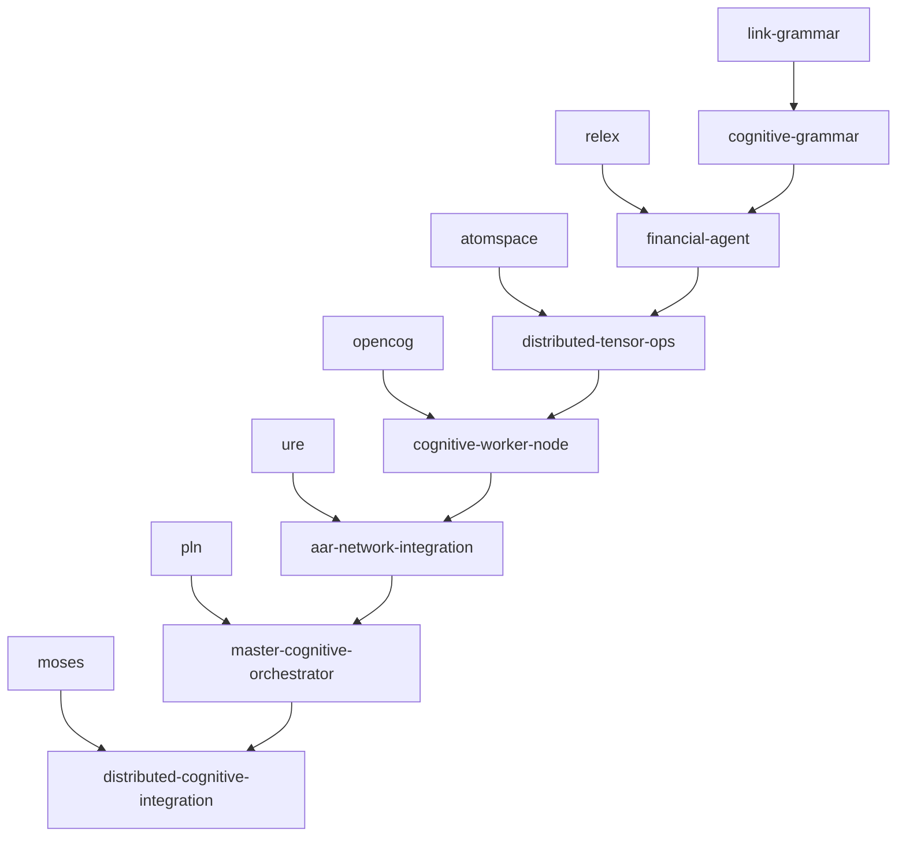

# OpenCog Repository Cross-Links for Distributed Cognitive Tensor Network

## Core Tensor Operations Integration

### **AtomSpace & Knowledge Representation**
- **opencog/atomspace** → `distributed-tensor-ops.ts`
  - Map tensor operations to Atom types and TruthValues
  - Implement distributed attention allocation via AttentionBank
  - Cross-link: `TensorAtom` class extends `Node` for tensor storage

- **opencog/atomspace-cog** → `cognitive-worker-node.ts`
  - Integrate Cog server with cognitive worker nodes
  - Cross-link: Worker nodes as distributed Cog instances
  - Enable network-wide AtomSpace synchronization

- **opencog/atomspace-rocks** → `network-coordination-system.ts`
  - Use RocksDB for persistent tensor state across workers
  - Cross-link: Distributed memory persistence layer
  - Enable fault-tolerant cognitive state recovery

### **Reasoning & Inference Engines**
- **opencog/ure** → `aar-network-integration.ts`
  - Unified Rule Engine for distributed logical reasoning
  - Cross-link: AAR geometric reasoning with PLN inference
  - Map attention heads to rule application contexts

- **opencog/pln** → `master-cognitive-orchestrator.ts`
  - Probabilistic Logic Networks for uncertainty reasoning
  - Cross-link: Tensor uncertainty propagation via PLN
  - Implement distributed probabilistic inference

- **opencog/moses** → `distributed-cognitive-integration.ts`
  - Meta-Optimizing Semantic Evolutionary Search
  - Cross-link: Evolutionary optimization of tensor network topology
  - Enable self-improving cognitive architectures

### **Language & Communication**
- **opencog/opencog** → `cognitive-worker-node.ts`
  - Main OpenCog framework integration
  - Cross-link: CogServer as worker node communication layer
  - Enable distributed cognitive agent messaging

- **opencog/link-grammar** → `cognitive-grammar.ts`
  - Natural language parsing for financial queries
  - Cross-link: Grammar-guided tensor attention mechanisms
  - Parse financial language into cognitive tensor operations

- **opencog/relex** → `financial-agent.ts`
  - Relationship extraction from financial documents
  - Cross-link: Financial entity relationship tensors
  - Map semantic relationships to tensor network connections

### **Learning & Adaptation**
- **opencog/as-moses** → `network-coordination-system.ts`
  - AtomSpace-integrated evolutionary learning
  - Cross-link: Evolve tensor network architectures
  - Optimize attention head configurations

- **opencog/opencog-to-minecraft** → `distributed-cognitive-integration.ts`
  - Virtual environment for cognitive testing
  - Cross-link: Simulate financial environments for training
  - Test distributed cognition in controlled settings

### **Visualization & Analysis**
- **opencog/atomspace-explorer** → `master-cognitive-orchestrator.ts`
  - Visual exploration of distributed cognitive states
  - Cross-link: Real-time tensor network visualization
  - Monitor attention flow across worker nodes

- **opencog/cogutil** → All tensor network components
  - Core utilities for cognitive processing
  - Cross-link: Shared utilities across all worker nodes
  - Common tensor operation primitives

## Advanced Integration Points

### **Distributed Reasoning Architecture**
```typescript
// opencog/ure integration with tensor operations
class DistributedRuleEngine {
  constructor(
    private tensorOps: DistributedTensorOps,
    private ureEngine: UnifiedRuleEngine
  ) {}
  
  async applyRulesAcrossNetwork(
    premises: TensorAtom[],
    workerNodes: CognitiveWorkerNode[]
  ): Promise<InferenceResult[]> {
    // Distribute rule application across attention heads
    const results = await Promise.all(
      workerNodes.map(node => 
        node.applyLocalRules(premises, this.ureEngine)
      )
    );
    
    // Aggregate results via tensor operations
    return this.tensorOps.aggregateInferences(results);
  }
}
```

### **AtomSpace Tensor Integration**
```typescript
// opencog/atomspace integration with cognitive tensors
class TensorAtomSpace extends AtomSpace {
  private tensorStore: DistributedTensorStore;
  
  addTensorAtom(tensor: CognitiveTensor): TensorAtom {
    const atom = new TensorAtom(tensor);
    this.add(atom);
    this.tensorStore.distributeTensor(tensor);
    return atom;
  }
  
  queryTensorPattern(pattern: TensorPattern): TensorAtom[] {
    // Use pattern matching with tensor similarity
    return this.getAtomsOfType('TensorAtom')
      .filter(atom => this.tensorStore.matchesPattern(atom.tensor, pattern));
  }
}
```

### **PLN Uncertainty Propagation**
```typescript
// opencog/pln integration with tensor uncertainty
class TensorPLN extends PLNReasoner {
  propagateUncertainty(
    tensorNetwork: DistributedTensorNetwork,
    inference: PLNInference
  ): UncertaintyTensor {
    // Map PLN truth values to tensor uncertainty
    const uncertaintyTensor = this.createUncertaintyTensor(inference);
    
    // Propagate through attention heads
    return tensorNetwork.propagateUncertainty(uncertaintyTensor);
  }
}
```

## Repository-Specific Implementation Mappings

### **Core Infrastructure (Tier 1)**
1. **opencog/atomspace** ↔ `distributed-tensor-ops.ts`
   - Tensor atoms as first-class AtomSpace citizens
   - Distributed attention allocation mechanisms
   - Cross-worker atom synchronization

2. **opencog/opencog** ↔ `cognitive-worker-node.ts`
   - CogServer as worker node backbone
   - Distributed cognitive agent framework
   - Network-wide communication protocols

3. **opencog/ure** ↔ `aar-network-integration.ts`
   - Geometric reasoning with unified rules
   - Distributed logical inference
   - AAR-guided rule application

### **Reasoning Engines (Tier 2)**
4. **opencog/pln** ↔ `master-cognitive-orchestrator.ts`
   - Probabilistic reasoning coordination
   - Uncertainty tensor propagation
   - Network-wide inference orchestration

5. **opencog/moses** ↔ `distributed-cognitive-integration.ts`
   - Evolutionary tensor network optimization
   - Self-improving cognitive architectures
   - Adaptive attention head evolution

### **Language Processing (Tier 3)**
6. **opencog/link-grammar** ↔ `cognitive-grammar.ts`
   - Financial language parsing
   - Grammar-guided attention mechanisms
   - Linguistic tensor representations

7. **opencog/relex** ↔ `financial-agent.ts`
   - Financial relationship extraction
   - Entity relationship tensors
   - Semantic network construction

### **Specialized Components (Tier 4)**
8. **opencog/spacetime** ↔ `network-coordination-system.ts`
   - Temporal reasoning for financial flows
   - Spacetime tensor representations
   - Distributed temporal coordination

9. **opencog/ghost** ↔ `cognitive-worker-node.ts`
   - Goal-oriented behavior in workers
   - Hierarchical action planning
   - Distributed goal achievement

10. **opencog/attention** ↔ All components
    - Attention allocation algorithms
    - Focus management across network
    - Cognitive resource optimization

## Integration Roadmap

### **Phase 1: Core Integration (Weeks 1-4)**
- Implement TensorAtom class in atomspace
- Create distributed CogServer architecture
- Basic tensor operation distribution

### **Phase 2: Reasoning Integration (Weeks 5-8)**
- PLN uncertainty tensor propagation
- URE distributed rule application
- MOSES evolutionary optimization

### **Phase 3: Language Integration (Weeks 9-12)**
- Link-grammar financial parsing
- RelEx relationship extraction
- Natural language tensor interfaces

### **Phase 4: Advanced Features (Weeks 13-16)**
- Spacetime financial modeling
- GHOST goal-oriented behavior
- Complete cognitive architecture

## Cross-Repository Dependencies



This comprehensive mapping ensures that every aspect of our distributed cognitive tensor network leverages the full power of the OpenCog ecosystem, creating a truly integrated artificial general intelligence system for financial cognition.

